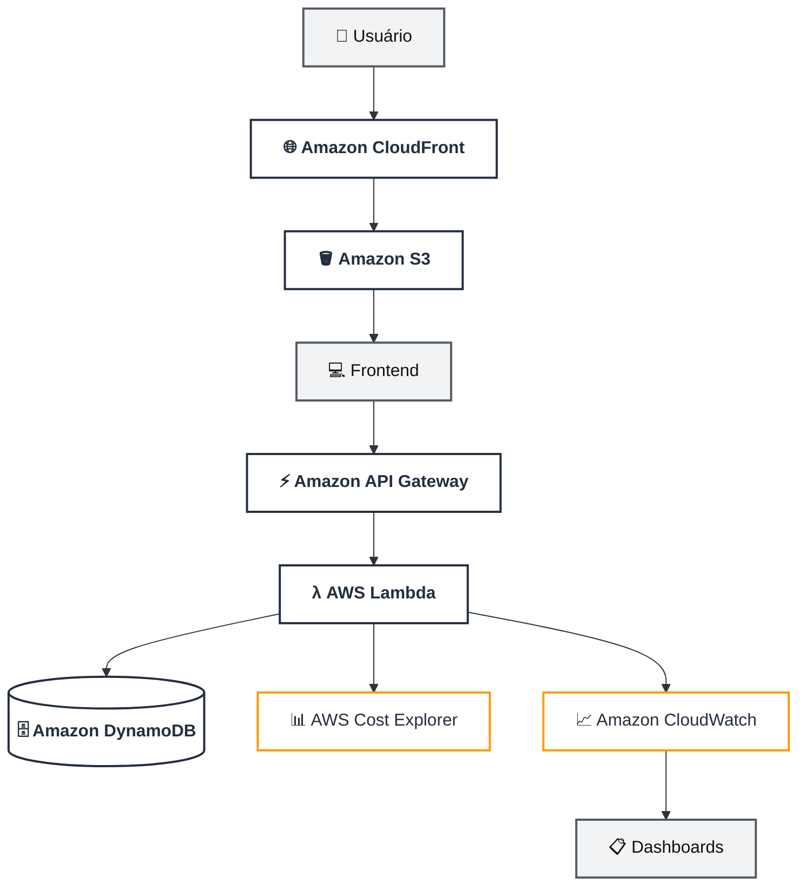

# 🚀 AWS CloudOps Portal

Projeto de **Infrastructure as Code (IaC)** para provisionamento de uma plataforma **CloudOps Serverless**, focada em **observabilidade, FinOps, inventário dinâmico e automação operacional** utilizando **Terraform** e serviços gerenciados da AWS.

---

## 📌 Visão Geral

Infraestrutura de nível **production-like** desenvolvida totalmente como código utilizando **Terraform**, provisionando automaticamente um portal operacional para gerenciamento e visualização dinâmica de recursos AWS através de um **Motor de Descoberta Automática baseado em Tags**, utilizando a **AWS Resource Groups Tagging API**.

A solução é composta por:

* Amazon CloudFront
* Amazon S3
* AWS Lambda (Python 3.11)
* Amazon API Gateway HTTP
* Amazon DynamoDB
* Amazon CloudWatch
* AWS Cost Explorer
* IAM Least Privilege

O projeto simula um portal utilizado por equipes de **Cloud Engineering / CloudOps** para visualizar informações operacionais da infraestrutura AWS, incluindo:

* Inventário dinâmico de recursos
* Métricas operacionais
* Monitoramento
* Custos da infraestrutura
* Indicadores de saúde dos serviços
* Descoberta automática de recursos baseada em Tags

---

## 🎯 Objetivo do Projeto

Projetar e demonstrar uma arquitetura moderna baseada em serviços **Serverless**, aplicando boas práticas de **Cloud Engineering, Infrastructure as Code, Observabilidade, FinOps e Segurança**.

Este projeto faz parte do meu portfólio profissional e demonstra a construção de uma aplicação automatizada utilizando serviços gerenciados da AWS.

Os principais pilares da solução são:

* **Infrastructure as Code (IaC):** Provisionamento automatizado utilizando Terraform.
* **Arquitetura Serverless:** Utilização de serviços gerenciados sem necessidade de administrar servidores.
* **Descoberta Dinâmica de Recursos:** Varredura automática da AWS através de Tags, sem necessidade de alterações manuais no frontend.
* **Observabilidade Centralizada:** Monitoramento, métricas, logs e dashboards através do Amazon CloudWatch.
* **FinOps:** Integração com a API do AWS Cost Explorer para análise financeira.
* **Segurança por Padrão:** Aplicação do princípio de Menor Privilégio (*Least Privilege*).
* **Alta Disponibilidade:** Distribuição global do frontend através do Amazon CloudFront.

---

# 🏗️ Arquitetura do Sistema

A aplicação utiliza uma arquitetura **serverless e orientada a serviços AWS**, separando a camada de apresentação, processamento, persistência, análise de custos e observabilidade.

O fluxo principal da aplicação ocorre da seguinte forma:

1. O **usuário** acessa a aplicação através do **Amazon CloudFront**.
2. O **CloudFront** distribui o frontend hospedado no **Amazon S3**.
3. O **Frontend** realiza chamadas ao **Amazon API Gateway**.
4. O **API Gateway** encaminha as requisições para funções **AWS Lambda**.
5. As funções Lambda processam as informações e interagem com:

   * **Amazon DynamoDB** para persistência de dados;
   * **AWS Cost Explorer** para obtenção de informações relacionadas a custos;
   * **AWS Resource Groups Tagging API** para descoberta dinâmica de recursos;
   * **Amazon CloudWatch** para métricas, logs e observabilidade.
6. As informações coletadas pelo **CloudWatch** são utilizadas para alimentar os **Dashboards** da aplicação.

### Diagrama de Arquitetura



### 🧠 Decisões Arquiteturais

* **Amazon CloudFront:** Distribuição global do frontend utilizando CDN.
* **Origin Access Control (OAC):** Mantém o bucket S3 privado, permitindo acesso ao conteúdo somente através do CloudFront.
* **Amazon S3:** Hospedagem dos arquivos estáticos do frontend.
* **AWS Lambda:** Backend serverless em Python 3.11 responsável pela lógica de negócio, autenticação e processamento das requisições.
* **AWS Resource Groups Tagging API:** Utilizada pelo Motor de Descoberta para localizar dinamicamente recursos AWS através de Tags.
* **Amazon API Gateway HTTP:** Camada de exposição da API utilizada pelo frontend.
* **Amazon DynamoDB:** Persistência dos dados da aplicação e informações relacionadas aos usuários.
* **Amazon CloudWatch:** Monitoramento, métricas, logs e dashboards centralizados.
* **AWS Cost Explorer:** Consulta de custos e projeções financeiras da conta AWS.
* **IAM Least Privilege:** Permissões mínimas necessárias para cada componente da arquitetura.

---

# 📦 Recursos Implementados & Provisionados

## 🌐 Frontend & Navegação

* Amazon S3
* Amazon CloudFront
* Origin Access Control (OAC)
* Aplicação Web Serverless
* Dashboard
* Infrastructure
* Serverless Observer
* Monitoring
* Costs / FinOps

## ⚙️ Backend & Lógica

* AWS Lambda
* Amazon API Gateway HTTP
* Motor de Descoberta de Recursos
* AWS Resource Groups Tagging API
* IAM Roles
* IAM Policies customizadas

## 🗄️ Banco de Dados

* Amazon DynamoDB

## 📈 Observabilidade

* Amazon CloudWatch
* CloudWatch Dashboard
* CloudWatch Log Groups
* CloudWatch Alarms

## 💰 FinOps

* AWS Cost Explorer API
* Visualização de custos
* Projeções de gastos
* Análise financeira por serviço

## 🔒 Segurança

* IAM Least Privilege
* Bucket S3 privado
* CloudFront Origin Access Control
* IAM Roles específicas
* Políticas customizadas

---

# 🔒 Segurança

A arquitetura foi desenvolvida seguindo o princípio de **Menor Privilégio (*Least Privilege*)**, implementando:

* Bucket S3 totalmente privado.
* CloudFront utilizando Origin Access Control (OAC).
* IAM Roles específicas para execução da Lambda.
* Políticas customizadas com escopo restrito.
* Permissões específicas para acesso ao DynamoDB.
* Permissões específicas para consulta de Tags.
* Integração entre API Gateway e Lambda sem exposição direta do backend.
* Separação entre frontend, API e camada de persistência.

---

# 👁️ Observabilidade

O projeto integra monitoramento através do **Amazon CloudWatch**.

São monitorados:

* Execuções da Lambda
* Latência da Lambda
* Taxa de erros
* Invocações do API Gateway
* Logs centralizados
* Métricas operacionais
* Dashboards customizados
* Estado operacional da arquitetura Serverless

---

# 💰 FinOps

O **CloudOps Portal** integra-se ao **AWS Cost Explorer**, permitindo visualizar informações financeiras da infraestrutura AWS.

A aplicação permite consultar:

* Custos diários
* Custos mensais
* Projeções de gastos
* Distribuição de custos por serviço
* Informações financeiras da conta AWS

Essa integração demonstra a aplicação prática de conceitos de **FinOps**, aproximando a operação de Cloud da governança financeira.

---

# 🏷️ Motor de Descoberta Automática

Um dos principais componentes do projeto é o **Motor de Descoberta de Recursos**.

A Lambda utiliza a **AWS Resource Groups Tagging API** para identificar automaticamente recursos AWS que possuem a Tag utilizada pelo projeto.

Exemplo:

```text
CloudOps = true
```

Isso permite que novos recursos sejam incorporados ao inventário sem necessidade de modificar manualmente o frontend.

Por exemplo, recursos como:

* Lambda
* S3
* DynamoDB
* SQS
* SNS
* EC2
* RDS

podem ser identificados dinamicamente desde que suportem a consulta através da API de Tags e estejam devidamente identificados.

O frontend apenas consome a resposta da API, mantendo a aplicação desacoplada da infraestrutura específica existente na conta AWS.

---

# 📁 Estrutura do Projeto

```text
.
├── api_gateway.tf                 # API Gateway HTTP, rotas e integrações
├── backend.tf                     # Backend remoto do Terraform
├── cloudfront.tf                  # CloudFront e distribuição global
├── cloudwatch.tf                  # Alarms, Log Groups e Dashboards
├── dynamodb.tf                    # Tabela DynamoDB
├── frontend.tf                    # S3, Bucket Policy e OAC
├── iam.tf                         # IAM Roles e políticas
├── locals.tf                      # Locals e Tags globais
├── outputs.tf                     # Outputs da infraestrutura
├── providers.tf                   # Provider AWS
├── variables.tf                   # Variáveis da infraestrutura
├── versions.tf                    # Versões do Terraform e providers
├── dev.tfvars                     # Variáveis do ambiente de desenvolvimento
│
├── frontend/
│   ├── assets/                    # Imagens, ícones e mídias
│   ├── index.html                 # Login
│   ├── register.html              # Cadastro
│   ├── dashboard.html             # Dashboard principal
│   ├── infrastructure.html        # Inventário de infraestrutura
│   ├── serverless-dashboard.html  # Serverless Observer
│   ├── monitoring.html             # Monitoramento
│   ├── costs.html                  # FinOps
│   └── config.js                  # Configuração dinâmica da API
│
└── README.md                      # Documentação do projeto
```

---

# 💡 Páginas da Aplicação

### 🔐 `index.html` — Login

Porta de entrada da aplicação.

Realiza a autenticação do usuário através da API, com validação das credenciais armazenadas no DynamoDB.

### 📝 `register.html` — Cadastro

Página dedicada ao registro de novos usuários.

Os dados são enviados para o backend através do API Gateway e processados pela Lambda antes da persistência no DynamoDB.

### 📊 `dashboard.html` — Dashboard

Painel principal da aplicação.

Apresenta indicadores operacionais, status dos serviços, informações de custos e atividades da infraestrutura.

### 🏗️ `infrastructure.html` — Infrastructure

Interface destinada à visualização do inventário da infraestrutura AWS.

Permite consultar os recursos identificados pela aplicação.

### ⚡ `serverless-dashboard.html` — Serverless Observer

É um dos principais componentes do projeto.

Consome a rota `/resources` da Lambda, que utiliza a **AWS Resource Groups Tagging API** para localizar dinamicamente recursos AWS identificados através de Tags.

Exemplo:

```text
CloudOps = true
```

Dessa forma, novos recursos podem aparecer automaticamente no inventário sem necessidade de alterações no código do frontend.

### 📈 `monitoring.html` — Monitoring

Central de observabilidade da plataforma.

Apresenta informações relacionadas a:

* Performance
* Latência
* Invocações
* Erros
* Status operacional

### 💰 `costs.html` — Costs / FinOps

Dashboard financeiro responsável por consumir informações do **AWS Cost Explorer**.

Apresenta:

* Custos diários
* Custos mensais
* Projeções
* Distribuição de custos

### ⚙️ `config.js`

Arquivo utilizado para desacoplar o frontend do backend.

A URL do API Gateway é disponibilizada dinamicamente para que as páginas do frontend possam realizar as chamadas à API sem possuir endpoints fixos diretamente no código.

---

# ⚙️ Pré-requisitos

Antes de executar o projeto, certifique-se de possuir:

* Terraform 1.5+
* AWS CLI
* Credenciais AWS configuradas
* Permissões suficientes para criação dos recursos
* AWS Cost Explorer habilitado na conta

Exemplo de validação da AWS CLI:

```bash
aws sts get-caller-identity
```

---

# 🚀 Como Executar

## 1. Inicializar o Terraform

```bash
terraform init
```

## 2. Criar / Selecionar Workspace

```bash
terraform workspace select dev || terraform workspace new dev
```

## 3. Validar a Configuração

```bash
terraform validate
```

## 4. Formatar os Arquivos

```bash
terraform fmt -recursive
```

## 5. Planejar as Alterações

```bash
terraform plan -var-file="dev.tfvars"
```

## 6. Provisionar a Infraestrutura

```bash
terraform apply -var-file="dev.tfvars"
```

Após a conclusão do `terraform apply`, os principais endpoints e recursos estarão disponíveis através dos outputs definidos no Terraform.

---

# 🧹 Destruir o Ambiente

Para remover os recursos provisionados pelo Terraform:

```bash
terraform destroy -var-file="dev.tfvars"
```

> ⚠️ **Atenção:** o comando `terraform destroy` remove os recursos gerenciados pelo Terraform. Utilize-o somente quando tiver certeza de que o ambiente pode ser destruído.

---

# 🌐 Outputs

Após o `terraform apply`, os principais outputs disponibilizados pelo projeto incluem:

* URL do CloudFront
* Endpoint do API Gateway
* Nome da função Lambda
* Nome da tabela DynamoDB
* Nome do bucket S3
* Informações do CloudWatch Dashboard

Os outputs podem ser consultados através de:

```bash
terraform output
```

---

# 🔥 Destaques Técnicos

* Arquitetura **Serverless**
* Infrastructure as Code utilizando Terraform
* Backend desacoplado com **API Gateway + Lambda**
* Frontend distribuído globalmente através do **CloudFront**
* Bucket S3 privado protegido por **Origin Access Control**
* Persistência NoSQL utilizando **DynamoDB**
* Motor de Descoberta Automática baseado em Tags
* Integração com **AWS Resource Groups Tagging API**
* Integração nativa com **AWS Cost Explorer**
* Observabilidade utilizando **Amazon CloudWatch**
* Dashboards operacionais
* Logs centralizados
* IAM seguindo o princípio de **Least Privilege**
* Configuração dinâmica do frontend através do `config.js`
* Provisionamento e gerenciamento totalmente automatizados com Terraform

---


# 👨‍💻 Autor

**Frederico Almeida**

*Cloud Engineer | AWS Certified Solutions Architect – Associate | IaC
